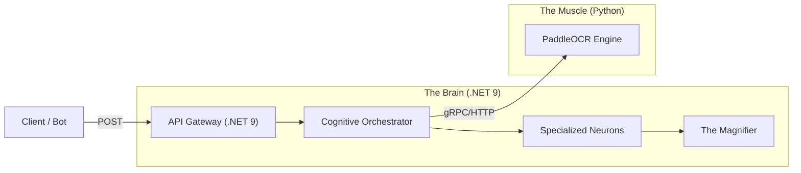

<div align="center">

# 🛡️ RoK Vision API


**Next-Gen Cognitive OCR for Rise of Kingdoms**

<p align="center">
  <a href="#-key-features">Key Features</a> •
  <a href="#-architecture">Architecture</a> •
  <a href="#-getting-started">Getting Started</a> •
  <a href="#-api-usage">API Usage</a> •
  <a href="ROADMAP.md">Roadmap</a> •
  <a href="CONTRIBUTING.md">Contributing</a>
</p>

</div>

---

## 📖 Overview

**RoK Vision** is a high-performance **Cognitive OCR API** designed to transform *Rise of Kingdoms* screenshots into structured data. By combining **Deep Learning (PaddleOCR)** with a **Topological C# Orchestrator**, Vision understands the context of the screen, making it resolution-independent and extremely resilient to UI variations.

---

## 🚀 Key Features

*   **👤 Governor Profiles**
    Extracts ID, Name, Power, Kill Points, and Civilization from the profile screen with sub-second latency.
*   **⚔️ Battle Intelligence**
    Full analysis of PvP and PvE reports, including troop metrics, casualty rates, and boss identification.
*   **🎒 Inventory Intelligence (NEW)**
    Reads complex inventory screens (Action Points & XP Books). Supports **Multi-Screenshot Merging** (scrolling) and uses **Color Detection** to distinguish items.
*   **📐 Warp & Isolate**
    Automatically detects the report container, removes background noise, and applies perspective correction.
*   **🎨 Visual Cognitive Engine**
    Goes beyond text: uses Computer Vision to detect item rarity (colors) and iconic structures, making it resilient to visual noise.
*   **🔍 The Magnifier (Auto-Healing)**
    Automatic regional re-scanning with specialized digital filters (White Isolation, Inverted Binary) for low-confidence areas.
*   **🌐 Multicultural Core**
    Optimized for Latin alphabets (EN, PT, ES, FR, DE) with smart detection of unsupported characters.

---

## 🏁 Getting Started

The easiest way to run RoK Vision is using Docker. It sets up the Neural Network environment and the API Gateway automatically.

👉 **[Read the Installation Guide](GETTING_STARTED.md)** to get up and running in 5 minutes.

---

## 🏗️ Architecture

The solution follows a distributed architecture: the **Muscle** (Python) handles the heavy AI computer vision, while the **Brain** (C#) manages the logical orchestration.



---

## 🔌 API Usage

### 1. Governor Profile
`POST /api/governor/analyze`  
Extracts statistics from the governor's profile screen.

#### Response (JSON)
```json
{
  "success": true,
  "message": "Scan completed successfully.",
  "data": {
    "id": 193397278,
    "name": "nan0z01",
    "allianceTag": "RE87",
    "allianceName": "RoyalEmpire",
    "power": 99999012,
    "killPoints": 2063935270,
    "civilization": "Germany",
    "isSuccessfulRead": true
  },
  "processingTimeSeconds": 0.77
}
```

### 2. Battle Reports
`POST /api/reports/analyze`  
Analyzes complex battle logs, identifying if the target is a Player or NPC.

#### Sample Response (Battle Report)
```json
{
  "success": true,
  "overallConfidence": 99.5,
  "data": {
    "type": "Barbarian",
    "attacker": { "governorName": "ml Feels", "totalUnits": 7302, "dead": 0 },
    "defender": { 
        "isNpc": true, 
        "governorName": "Lv. 10 Barbarian", 
        "pveStats": { "damageReceivedPercentage": 43.2 } 
    }
  }
}
```

### 3. Action Points Inventory
`POST /api/ap/analyze`  
Extracts AP items from lists. Supports sending multiple images (scroll) in a single request.

#### Response (JSON)
```json
{
  "success": true,
  "message": "Success. 4 items identified.",
  "data": {
    "grandTotalAp": 338750,
    "currentBarValue": 875,
    "items": [
      {
        "name": "Basic Action Point Recovery",
        "apValue": 100,
        "quantity": 2086,
        "totalValue": 208600
      }
    ],
    "warnings": ["[Conflict] Basic AP: 155 vs 2086. Using 2086 (Larger Value Logic)."]
  }
}
```

## 4. Experience Inventory (Tomes of Knowledge)
`POST /api/xp/analyze`  
Analyzes the complex "Other" tab grid. Uses color detection to filter out non-XP items.

#### Response (JSON)
```json
{
  "success": true,
  "data": {
    "totalXp": 182180300,
    "items": [
      {
        "itemId": "XP_1000",
        "unitValue": 1000,
        "quantity": 145964,
        "detectedColor": "Blue"
      },
      {
        "itemId": "XP_50000",
        "unitValue": 50000,
        "quantity": 58,
        "detectedColor": "Gold"
      }
    ]
  }
}
```

---

## 📸 Best Practices
To ensure **>95% accuracy**, follow the "Golden Screenshot" rules:
1. **Full Screen:** Send original screenshots. Do not crop the image manually.
2. **No Overlays:** Close the chat, notification bubbles, or side menus before capturing.
3. **Brightness:** Use standard in-game brightness for optimal contrast.

---

## Support the Project
If RoKVision helps your alliance, consider buying me a coffee! ☕
- Pix: 031c9e65-66a3-4611-822b-796e227e200a
- Ko-fi: [link]

---

## 🤝 Contributing
See our [CONTRIBUTING.md](CONTRIBUTING.md) for details on how to help the project.

Pull requests are welcome! For major changes, please open an issue first.

### 📝 License
Distributed under the MIT License. See `LICENSE` for more information.