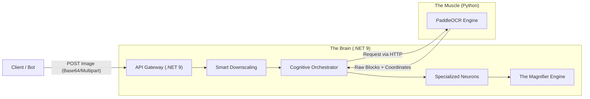

<div align="center">

# 🛡️ RoK Vision API


**Next-Gen Cognitive OCR for Rise of Kingdoms**

<p align="center">
  <a href="#-key-features">Key Features</a> •
  <a href="#-architecture">Architecture</a> •
  <a href="#-benchmarks">Benchmarks</a> •
  <a href="#-getting-started">Getting Started</a> •
  <a href="#-api-usage">API Usage</a>
</p>

</div>

---

## 📖 Overview

**RoK Vision** is a high-performance, enterprise-grade **Cognitive OCR API** designed to extract governor statistics from *Rise of Kingdoms* screenshots with **100% precision** and **sub-second latency**.

Unlike traditional bots (like Roktracker) that rely on fixed coordinates and fragile screen scraping, Vision uses **Deep Learning (PaddleOCR)** combined with a **C# Cognitive Orchestrator** to understand image context. This makes it resolution-independent and resilient to UI changes.

---

## 🚀 Key Features

*   **🧠 Cognitive Orchestration**
    It doesn't just read text; it "thinks". Using specialized Neurons and Anchor logic, it locates data based on semantic proximity (e.g., finding the Power number *near* the word "Power").

*   **🔍 The Magnifier (Auto-Healing)**
    If the initial OCR scan fails or yields low confidence, the API automatically crops, applies filters (threshold/invert), and re-scans specific regions in parallel.

*   **⚡ Extreme Performance**
    *   **In-Memory Processing:** Zero disk I/O for requests (Direct RAM transfer).
    *   **Smart Downscaling:** Automatically optimizes 4K/2K images to 1080p for 4x faster processing without precision loss.
    *   **Hardware Agnostic:** Auto-configures for **NVIDIA GPUs** (CUDA) or optimized **CPU Vectorization** (MKLDNN).

*   **🌐 Resolution & Language Agnostic**
    Works with 720p, 1080p, 4K, Ultrawide, Mobile, and Tablet screenshots. Supports multiple in-game languages (EN, PT, CN, KR, RU, etc.).

*   **🐳 Docker Native**
    Fully containerized microservices architecture ready for horizontal scaling (Kubernetes/Swarm).

---

## 🏗️ Architecture

The solution follows a distributed architecture separating the "Brain" from the "Muscle":



---

## 📊 Benchmarks

Tests performed on a standard server **without GPU** (CPU Only with MKLDNN enabled).

| Scenario | Resolution | Original Time | **Vision Optimized** | Precision |
| :--- | :--- | :--- | :--- | :--- |
| **4K Screenshot** | 3840x2160 | ~2.00s | **1.00s** | 100% |
| **Profile (Standard)** | 1600x900 | 1.32s | **0.89s** | 100% |
| **City View (Noisy)** | 1920x1080 | 1.26s | **0.66s** | 100% |
| **Cropped Stats** | Custom | 0.88s | **0.58s** | 100% |

> **🚀 Pro Tip:** With an NVIDIA GPU enabled, expected latency drops to **< 0.1s**.

---

## 🛠️ Getting Started

### Prerequisites
*   [Docker](https://www.docker.com/) & Docker Compose

### Installation

1.  **Clone the repository:**
    ```bash
    git clone https://github.com/feels-dev/RoKVision.git
    cd RokVision.Api
    ```

2.  **Configure Hardware Acceleration** in `docker-compose.yml`:
    *   **For CPU Only (Standard):** Set `OCR_USE_GPU=false` and `OCR_ENABLE_MKLDNN=true`.
    *   **For NVIDIA GPU:** Set `OCR_USE_GPU=true`.

3.  **Build and Run:**
    ```bash
    docker-compose up --build -d
    ```

4.  **Access the API Documentation (Swagger):**
    *   Navigate to: `http://localhost:5000/swagger`

---

## 🔌 API Usage

### Endpoint: `POST /api/ocr/analyze`

Accepts an image file (`multipart/form-data`) or Base64 string.

#### Request (cURL)
```bash
curl -X POST "http://localhost:5000/api/ocr/analyze" \
     -H "accept: */*" \
     -H "Content-Type: multipart/form-data" \
     -F "Image=@/path/to/screenshot.png"
```

#### Response (JSON)
```json
{
  "success": true,
  "message": "Scan completed successfully.",
  "data": {
    "id": 193397278,
    "name": "nan0z01",
    "allianceTag": "RE87",
    "allianceName": "RoyalEmpire",
    "power": 99999012,
    "killPoints": 2063935270,
    "civilization": "Germany",
    "isSuccessfulRead": true
  },
  "processingTimeSeconds": 0.77
}
```

---

## ⚙️ Configuration

Environment variables located in `docker-compose.yml`:

| Variable | Service | Default | Description |
| :--- | :--- | :--- | :--- |
| `OCR_USE_GPU` | Python | `false` | Set `true` if NVIDIA GPU is available. |
| `OCR_ENABLE_MKLDNN` | Python | `true` | Enables Intel/AMD math acceleration (Vital for CPU). |
| `OCR_CPU_THREADS` | Python | `4` | Number of threads for OCR math operations. |
| `OCR_VERSION` | Python | `PP-OCRv4` | PaddleOCR model version (Mobile/Server). |

---

## ⚖️ Legal Disclaimer

**RoK Vision API** is a strictly passive image processing tool. 
*   It **does not** interact with the game client or memory.
*   It **does not** inject code.
*   It **does not** automate gameplay actions (macros).

It processes static image files uploaded by the user. The developers are not responsible for how end-users acquire the screenshots or use the extracted data.

---

## 🤝 Contributing

Pull requests are welcome! For major changes, please open an issue first to discuss what you would like to change.

---

### 📝 License

Distributed under the MIT License. See LICENSE for more information.

## Support the Project
If RoKVision helps your alliance, consider buying me a coffee! ☕
- Pix: 031c9e65-66a3-4611-822b-796e227e200a
- Ko-fi: [link]